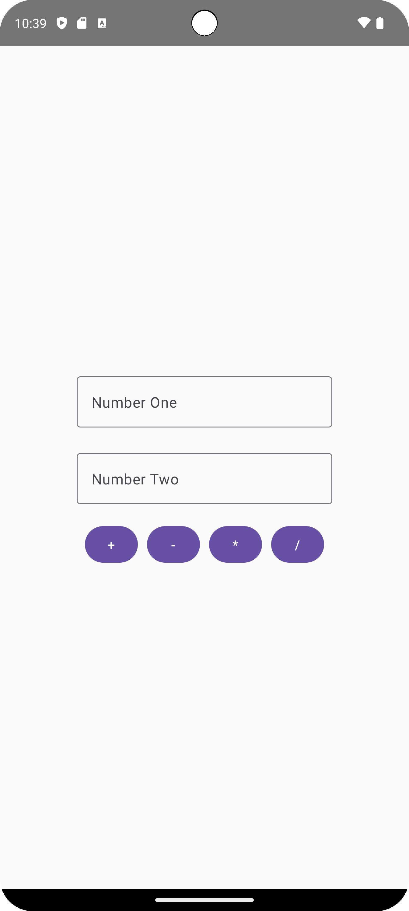

# Basit Hesap Makinesi Uygulaması

Bu Android uygulaması, kullanıcıların iki sayı arasında basit aritmetik işlemler gerçekleştirmesine izin verir.

## Özellikler

- Kullanıcılar, uygulamaya num1 ve num2 olarak adlandırılan iki sayı girebilir.
- Dört temel aritmetik işlemi gerçekleştiren butonlar sağlanır: Toplama (+), Çıkarma (-), Çarpma (*) ve Bölme (/).
- Kullanıcılar işlem butonlarına tıkladıklarında, num1 ve num2'nin değerlerine göre ilgili işlem gerçekleştirilir ve sonuç bir Toast mesajı olarak gösterilir.

## Nasıl Kullanılır

1. Uygulama başladığında, kullanıcı num1 ve num2'yi girmek için giriş alanlarına sahip olacaktır.
2. Num1 ve num2 girildikten sonra, kullanıcı dört temel aritmetik işlem butonlarından birine tıklayabilir.
3. İşlem butonlarına tıkladığında, ilgili işlem num1 ve num2'nin değerlerine göre gerçekleştirilir ve sonuç bir Toast mesajı olarak gösterilir.

## **Ekran Görüntüsü**

## Geliştirme Ortamı

Bu uygulama Kotlin programlama dili ve Jetpack Compose kullanılarak geliştirilmiştir. Android Studio gibi bir geliştirme ortamında açılabilir ve derlenebilir.

## Katkıda Bulunma

Katkıda bulunmak isterseniz, lütfen bir çekme isteği gönderin. Daha fazla özellik eklemek veya mevcut kodu geliştirmek için hoş geldiniz!

## Lisans

Bu proje MIT Lisansı altında lisanslanmıştır. Daha fazla bilgi için LICENSE dosyasına başvurun.
